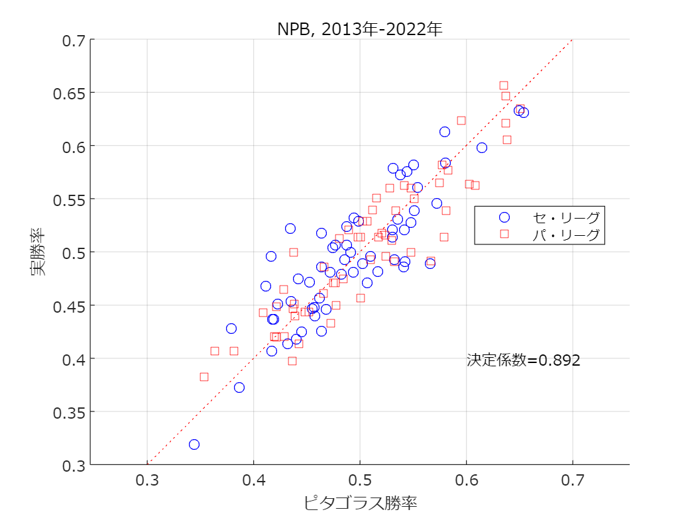

# <span style="color:rgb(213,80,0)">得失点からピタゴラス勝率を算出</span>

小中英嗣「科学で迫る勝敗の法則」


https://gihyo.jp/book/2024/978-4-297-13927-8


p.016-

```matlab
clear
clc
close all
```

xlsxファイルを読み込む

```matlab
tbl=readtable('pythagoreanWP.xlsx','VariableNamingRule','preserve');
tbl.Var2=categorical(tbl.Var2);
```

ピタゴラス勝率と実勝率

```matlab
plotX=tbl.("得点").^2./(tbl.("得点").^2+tbl.("失点").^2);
plotY=tbl.("率");
```

セ・パの各リーグごとに色を変えて散布図として図示

```matlab
ind=tbl.Var2=='セ';
R2=corr(plotX, plotY);
scatter(plotX(ind), plotY(ind),'bo');
hold on;grid on;axis equal;
ind=tbl.Var2=='パ';
title(['NPB, ' num2str(min(tbl.Var1)) '年-' num2str(max(tbl.Var1)) '年'])
scatter(plotX(ind), plotY(ind),'rs');
set(gca,'fontname','メイリオ');
text(0.6,0.4,['決定係数=' num2str(R2,'%1.3f')],'fontname','メイリオ')
plot([0.3 0.7],[0.3 0.7],'r:');
legend({'セ・リーグ','パ・リーグ'},'Location','best')
xlabel('ピタゴラス勝率')
ylabel('実勝率')
exportgraphics(gcf,'pythagoreanWP.pdf')
```

<center></center>

