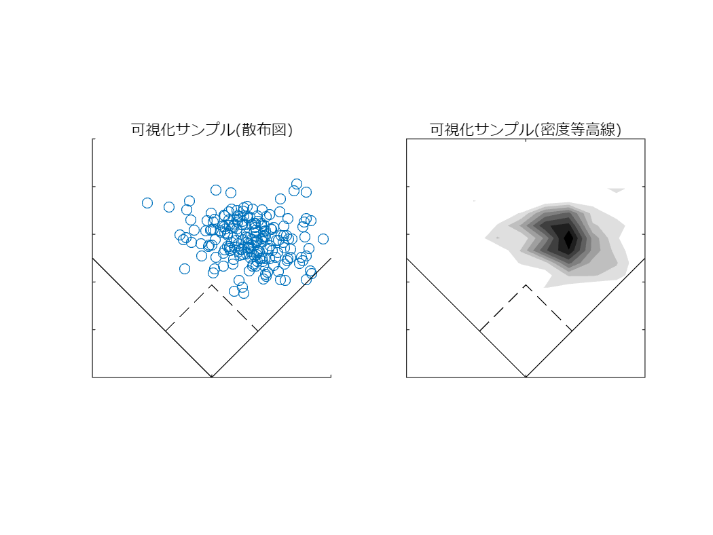

# <span style="color:rgb(213,80,0)">可視化サンプル(打球位置)</span>

小中英嗣「科学で迫る勝敗の法則」


https://gihyo.jp/book/2024/978-4-297-13927-8


p.32

```matlab
clear
clc
close all
```

乱数でデータを生成

```matlab
rng(1); %括弧の中の値を変えると乱数も変わる
N=200;
th=(randn(N,1)*0.3+pi/5+ (randn(N,1)*0.3+pi/8))/2;
R=randn(N,1)*8-2*(th-pi/6).^2+62;

[R th-pi/4]
```

```TextOutput
ans = 200x2    
   63.1960   -0.3577
   68.4631   -0.0761
   66.5764   -0.1102
   70.5104   -0.2763
   55.4984   -0.4563
   68.3874   -0.2900
   59.3800   -0.4846
   71.4801   -0.3267
   62.5536   -0.5127
   50.5888   -0.1863
```

散布図および等高線図として可視化

```matlab
figure
subplot(1,2,1)
x=R.*cos(th);y=R.*sin(th);hold on;
xNew=[cos(pi/4) -sin(pi/4);sin(pi/4) cos(pi/4)]*[x';y'];
xNew=xNew';
scatter(xNew(:,1),xNew(:,2));axis equal;
axis([-50 50 0 100]);xticklabels([]);yticklabels([]);
plot([0 50],[0,50],'k-')
plot([-50 0],[50 0],'k-')
plot(27.431*sin(pi/4)*[-1 0 1],27.431*cos(pi/4)*[1 2 1],'k--')
title('可視化サンプル(散布図)','FontName','メイリオ')

subplot(1,2,2)
[N, XEdges, YEdges   ]= histcounts2(xNew(:,1),xNew(:,2),9);
[XMesh,YMesh] ...
    =meshgrid((XEdges(1:end-1)+XEdges(2:end))/2,...
    (YEdges(1:end-1)+YEdges(2:end))/2);
contourf(XMesh,YMesh,N',8,'LineStyle','none');hold on;colormap(flipud( colormap("gray")))
% scatter(xNew(:,1),xNew(:,2));
plot([0 50],[0,50],'k-');hold on;axis equal;
axis([-50 50 0 100]);xticklabels([]);yticklabels([]);
plot([-50 0],[50 0],'k-')
plot(27.431*sin(pi/4)*[-1 0 1],27.431*cos(pi/4)*[1 2 1],'k--')
title('可視化サンプル(密度等高線)','FontName','メイリオ')
exportgraphics(gcf,'visualizationSample.pdf')
```

<center></center>

