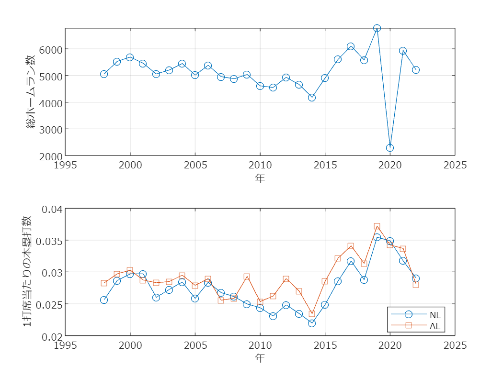

# <span style="color:rgb(213,80,0)">MLBのホームラン数</span>

小中英嗣「科学で迫る勝敗の法則」


https://gihyo.jp/book/2024/978-4-297-13927-8


p.36

```matlab
clear
clc
close all
```

データ読み込み


(tableの変数名に関する警告が表示されますが，動作に問題はありません)

```matlab
tbl=readtable('MLB_HomeRuns.xlsx','VariableNamingRule',"modify");
```

```TextOutput
警告: ファイルからの列ヘッダーは、table の変数名の作成前に、有効な MATLAB 識別子になるように変更されました。元の列ヘッダーは、VariableDescriptions プロパティに保存されています。
元の列ヘッダーを table 変数名として使用するには、'VariableNamingRule' を 'preserve' に設定します。
```

```matlab
tbl=rmmissing(tbl);

tlo=tiledlayout(2,1);nexttile
plot(tbl.Year, tbl.A_L__N_L_,'o-');grid on;hold on;
set(gca,'fontname','メイリオ');
xlabel('年');ylabel('総ホームラン数')
hold off

nexttile(tlo)
tbl_NL=readtable('sportsref_download NL.xls');
```

```TextOutput
警告: ファイルからの列ヘッダーは、table の変数名の作成前に、有効な MATLAB 識別子になるように変更されました。元の列ヘッダーは、VariableDescriptions プロパティに保存されています。
元の列ヘッダーを table 変数名として使用するには、'VariableNamingRule' を 'preserve' に設定します。
```

```matlab
ind=tbl_NL.Year>=1998;
plot(tbl_NL.Year(ind), tbl_NL.HR(ind)./tbl_NL.PA(ind),'o-');
tbl_AL=readtable('sportsref_download AL.xls');
```

```TextOutput
警告: ファイルからの列ヘッダーは、table の変数名の作成前に、有効な MATLAB 識別子になるように変更されました。元の列ヘッダーは、VariableDescriptions プロパティに保存されています。
元の列ヘッダーを table 変数名として使用するには、'VariableNamingRule' を 'preserve' に設定します。
```

```matlab
grid on;hold on;
set(gca,'fontname','メイリオ');
xlabel('年');ylabel('1打席当たりの本塁打数')
ind=tbl_AL.Year>=1998;
plot(tbl_AL.Year(ind), tbl_AL.HR(ind)./tbl_AL.PA(ind),'s-');
legend({'NL','AL'},'Location','best')
exportgraphics(gcf,'MLB_HRPerMatch.pdf')
```

<center></center>

