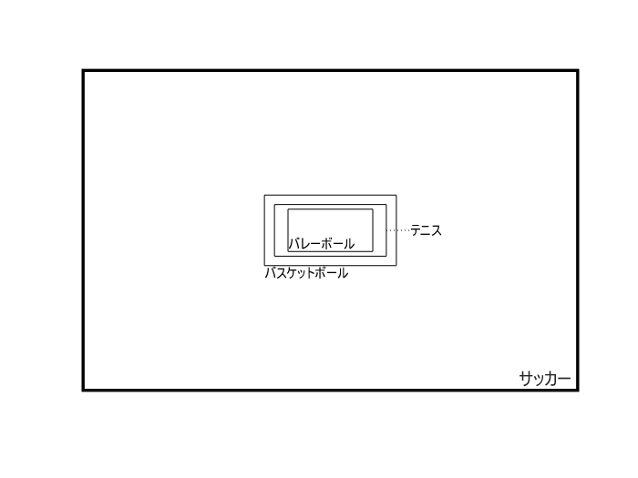

# <span style="color:rgb(213,80,0)">競技ごとの競技場の大きさ</span>

小中英嗣「科学で迫る勝敗の法則」


https://gihyo.jp/book/2024/978-4-297-13927-8


p.46

```matlab
clear
clc
close all
```

```matlab
figure
rectangle("Position",[-105/2 -68/2 105 68],'LineWidth',2);axis equal;
yline(-68/2,'-','サッカー','fontsize',12)
xticks([])
yticks([])
set(gca,'xcolor',[1 1 1])
set(gca,'ycolor',[1 1 1])
hold on;
tmpVal=[18 9];
rectangle("Position",[-tmpVal(1)/2 -tmpVal(2)/2 tmpVal(1) tmpVal(2)])
text(-tmpVal(1)/2 ,-tmpVal(2)/2,'バレーボール','VerticalAlignment','bottom')

tmpVal=[23.77 10.97];
rectangle("Position",[-tmpVal(1)/2 -tmpVal(2)/2 tmpVal(1) tmpVal(2)])
plot([tmpVal(1)/2 tmpVal(1)/2+5],[0 0],'k:')
text(tmpVal(1)/2+5 ,0,'テニス','VerticalAlignment','middle')

tmpVal=[28 15];
rectangle("Position",[-tmpVal(1)/2 -tmpVal(2)/2 tmpVal(1) tmpVal(2)])
set(gca,'fontname','メイリオ')
text(-tmpVal(1)/2 ,-tmpVal(2)/2,'バスケットボール','VerticalAlignment','top')

exportgraphics(gcf,'courtSize.pdf')
```

<center></center>

