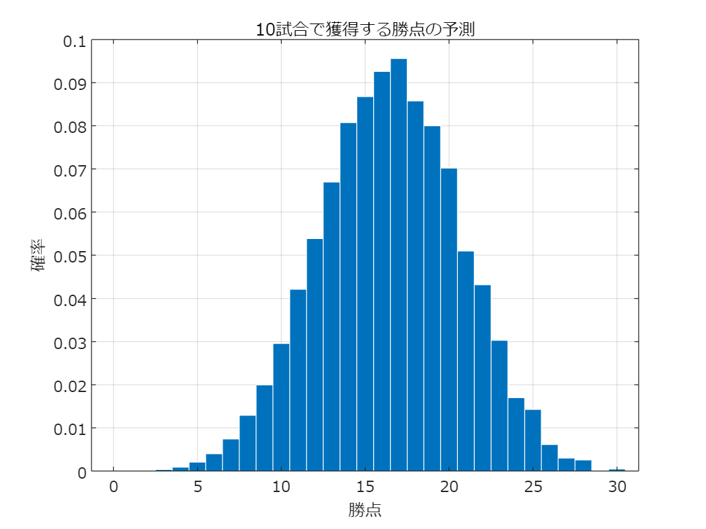

# <span style="color:rgb(213,80,0)">ポアソン分布とサッカーの得点分布</span>

小中英嗣「科学で迫る勝敗の法則」


https://gihyo.jp/book/2024/978-4-297-13927-8


p.047-051

```matlab
clear
clc
close all
```

データの読み込み(Jリーグの試合結果)

```matlab
load resultTable.mat tbl
```

2018年から2022年のJ1の試合結果を抽出

```matlab
rng(4);%括弧の中の数値を変えると乱数が変わります．
ind = (tbl.Year>=2018 & tbl.Year<=2022) ...
    & tbl.Category=='Ｊ１';
tbl_tmp=tbl(ind,:);
```

1チーム1試合当たりの平均得点

```matlab
mean([tbl_tmp.HomeGoals;tbl_tmp.AwayGoals])
```

```TextOutput
ans = 1.2989
```

1分あたりの平均得点確率

```matlab
p=ans/90
```

```TextOutput
p = 0.0144
```

```matlab
T=90;N=50;

M=zeros(N,T);
for n1=1:size(M,1)
    for n2=1:size(M,2)
        if rand<p
            M(n1,n2)=1;
        end
    end
end
```

N試合シミュレーションしたときの合計得点の頻度(左から0, 1, 2, 3, ...点)

```matlab
histcounts(sum(M'))
```

```TextOutput
ans = 1x4    
    17    18    13     2
```

```matlab

figure
sgtitle('ポアソン分布の例','fontname','メイリオ')
subplot(1,4,1:3)
colormap('gray');
imagesc(1-M);set(gca,'fontname','メイリオ');hold on;grid on;
ylim([0.5 50+0.5]);
xlabel('時間[分]')
ylabel('');yticklabels([])
subplot(1,4,4);
barh(sum(M'),'barwidth',1);grid on;set(gca,'fontname','メイリオ');
ylim([0.5 50+0.5]);
set(gca,'ydir','reverse');
xlabel('回数')
ylabel('');yticklabels([]);
exportgraphics(gcf,'poissonSample.pdf')
```

<center></center>


実得点数の割合とポアソン分布の比較

```matlab
bins=0:10;
hc_sim=poisspdf(bins,p*90);
hc_sim=hc_sim/sum(hc_sim);
hc_act=hist([tbl_tmp.HomeGoals;tbl_tmp.AwayGoals],bins);
hc_act=hc_act/sum(hc_act);

figure
bar(bins, hc_act);hold on;set(gca,'fontname','メイリオ');hold on;grid on;
plot(bins, hc_sim,'ro:','LineWidth',2);
xlabel('得点');ylabel('割合');
title('実得点数とポアソン分布(J1,2018-2022)')
legend({'実得点','ポアソン分布'},'fontname','メイリオ')
exportgraphics(gcf,'poissonAndActual.pdf')
```

<center></center>


平均得失点を与えた場合の勝・分・負の確率

```matlab
muGF=1.6;%平均得点
muGA=1.2;%平均失点
pMat=poisspdf(bins,muGF)'*poisspdf(bins,muGA);
pWin=sum(tril(pMat,-1),'all')
```

```TextOutput
pWin = 0.4666
```

```matlab
pDraw=sum(diag(pMat))
```

```TextOutput
pDraw = 0.2471
```

```matlab
pLose=sum(triu(pMat,1),'all')
```

```TextOutput
pLose = 0.2863
```

```matlab
figure;
cMap=colormap("gray");
cMap(1:50,:)=[];
cMap(end-50:end,:)=[];
colormap(cMap);
imagesc(pMat');set(gca,'fontname','メイリオ');hold on;axis equal
xlim([0.5 5.5]);ylim([0.5 5.5]);
xticks(1:5);xticklabels(0:4);
yticks(1:5);yticklabels(0:4);
xlabel('得点');ylabel('失点');
for n1=1:5
    for n2=1:5
        if pMat(n1,n2)>0.08
            text(n1,n2,num2str(pMat(n1,n2),'%1.3f'),'Color','k',...
                'HorizontalAlignment','center','FontName','メイリオ')
        else
            text(n1,n2,num2str(pMat(n1,n2),'%1.3f'),'Color','w',...
                'HorizontalAlignment','center','FontName','メイリオ')
        end
    end
end

plot([1 1 2 2 3 3 4 4 5]+0.5,[0 1 1 2 2 3 3 4 4]+0.5, ...
    'w--','LineWidth',2)
plot([0 1 1 2 2 3 3 4 4 5]+0.5,[0 0 1 1 2 2 3 3 4 4]+1.5, ...
    'k--','LineWidth',2)
exportgraphics(gcf,'poissonH2H.pdf')
```

<center></center>


同じ平均得失点で10試合行ったときの勝点分布の予測

```matlab
pPoints=1;
for n1=1:10 %10が試合数．値を変えても良い．
    pPoints=conv(pPoints, [pLose pDraw 0 pWin]);
end

figure
bar(0:size(pPoints,2)-1, pPoints,'BarWidth',1,'EdgeColor','w');
set(gca,'fontname','メイリオ');hold on;grid on;
title('10試合で獲得する勝点の予測')
xlabel('勝点')
ylabel('確率')
exportgraphics(gcf,'poissonPoints.pdf')
```

<center></center>


