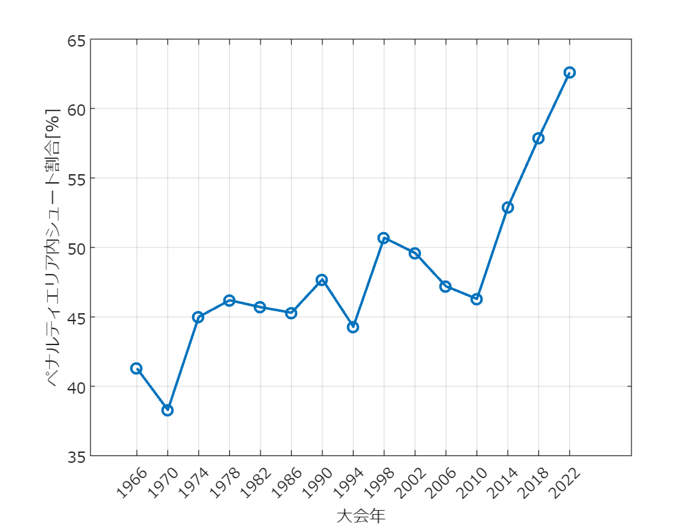

# <span style="color:rgb(213,80,0)">ペナルティエリア内シュート割合</span>

小中英嗣「科学で迫る勝敗の法則」


https://gihyo.jp/book/2024/978-4-297-13927-8


p.056

```matlab
clear
clc
close all
```

https://twitter.com/OptaAnalyst/status/1597553233836507139

```matlab
plotData=[1966 , 41.3;
1970 , 38.3;
1974 , 45.0;
1978 , 46.2;
1982 , 45.7;
1986 , 45.3;
1990 , 47.7;
1994 , 44.3;
1998 , 50.7;
2002 , 49.6;
2006 , 47.2;
2010 , 46.3;
2014 , 52.9;
2018 , 57.9;
2022 , 62.6];

figure
plot(plotData(:,1),plotData(:,2),'o-','LineWidth',1.5);
grid on;
xticks(plotData(:,1))
set(gca,'fontname','メイリオ')
xlabel('大会年')
ylabel('ペナルティエリア内シュート割合[%]')
exportgraphics(gcf,'ShotsInsideBox.pdf')
```

<center></center>


