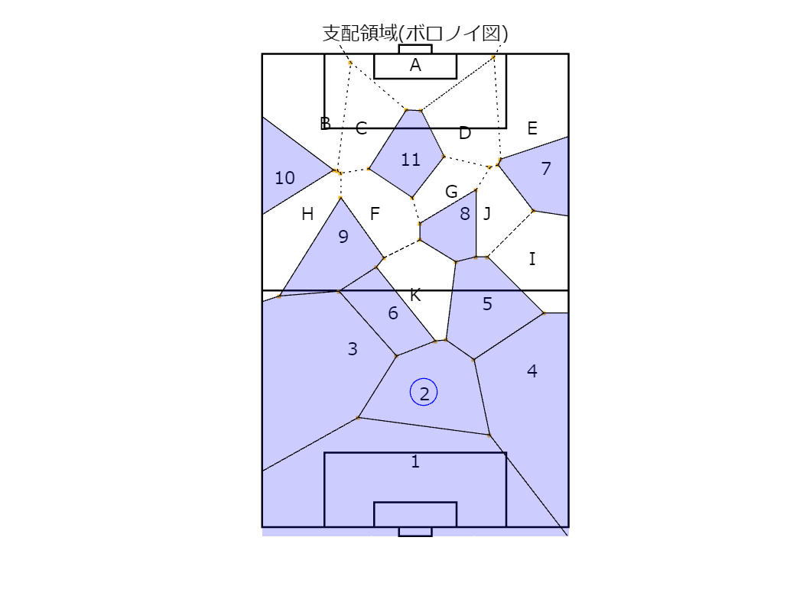
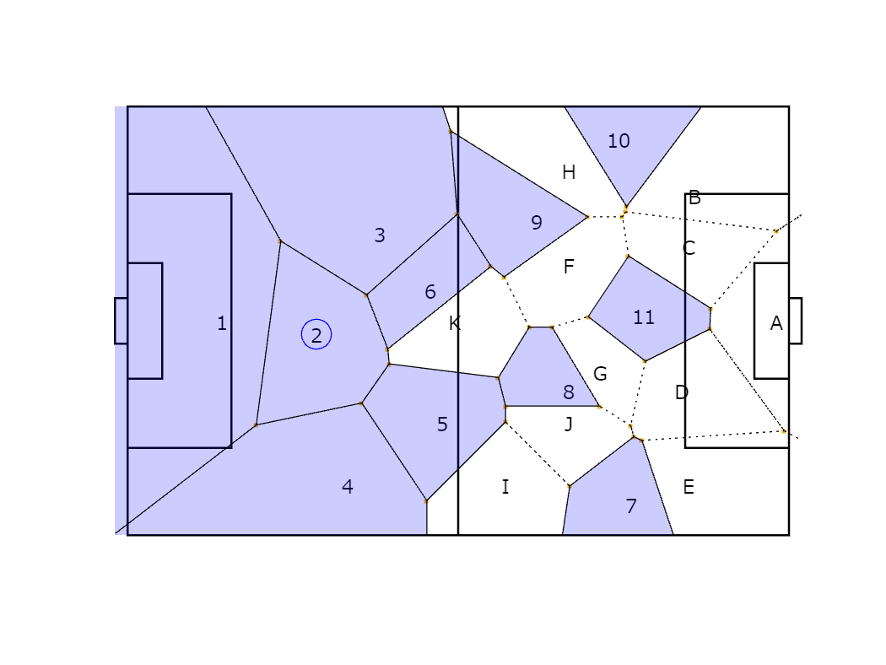

# <span style="color:rgb(213,80,0)">支配領域(ボロノイ図)</span>

小中英嗣「科学で迫る勝敗の法則」


https://gihyo.jp/book/2024/978-4-297-13927-8


p.061

```matlab
clear
clc
close all
```

ピッチ上のラインの描画

```matlab
figure;hold on;axis equal
rectangle('Position',[ (68-40.32)/2 ,105-16.5, 40.32 16.5 ],'EdgeColor','k', 'LineWidth',1)
rectangle('Position',[ (68-18.32)/2 ,105-5.5, 18.32 5.5 ],'EdgeColor','k', 'LineWidth',1)
rectangle('Position',[ (68-7.23)/2 ,105, 7.23 2 ],'EdgeColor','k', 'LineWidth',1)
rectangle('Position',[ 0 ,0, 68 105 ],'EdgeColor','k', 'LineWidth',1)
rectangle('Position',[ (68-40.32)/2 ,0, 40.32 16.5 ],'EdgeColor','k', 'LineWidth',1)
rectangle('Position',[ (68-18.32)/2 ,0, 18.32 5.5 ],'EdgeColor','k', 'LineWidth',1)
rectangle('Position',[ (68-7.23)/2 ,-2, 7.23 2 ],'EdgeColor','k', 'LineWidth',1)
plot([0 68],[105/2 105/2],'k-','LineWidth',1)
% plot( 68/2, 105-11,'ko','MarkerFaceColor','k')
set(gca,'xcolor',[1 1 1])
set(gca,'ycolor',[1 1 1])
```

選手の位置の設定

```matlab
pos.home=[34 15;
    36 30;
    20 40;
    60 35;
    50 50;
    29 48;
    63 80;
    45 70;
    18 65;
    5 78;
    33 82];
pos.away=[34 105-2;
    14 105-15;
    22 105-16;
    45 105-17;
    60 105-16;
    25 70;
    42 75;
    10 70;
    60 60;
    50 70;
    34 52];
pos.corners=[-68 -105;68*2 -105;-68 105*2;68*2 105*2];
```

散布図として描画

```matlab
scatter(pos.home(2,1),pos.home(2,2),200,'bo')
for n1=1:size(pos.home,1)
    text(pos.home(n1,1),pos.home(n1,2),num2str(n1),...
        'HorizontalAlignment','center', ...
        'VerticalAlignment','middle','FontName','メイリオ')
end
% scatter(pos.away(:,1),pos.away(:,2),'rs')
for n1=1:size(pos.away,1)
    text(pos.away(n1,1),pos.away(n1,2),char(64+n1),...
        'HorizontalAlignment','center', ...
        'VerticalAlignment','middle','FontName','メイリオ')
end
```

ボロノイ図(ボロノイ頂点とボロノイセル)を計算

```matlab
[v,c]=voronoin([pos.home;pos.away;pos.corners])
```

```TextOutput
v = 47x2    
       Inf       Inf
   34.0000  -88.3500
 -196.9521   52.5000
  -50.9433  -16.1482
 -100.9664   14.2106
   34.0000  205.1168
  -53.9477  131.5858
  -15.7651  157.6771
  264.2260   52.5000
   81.4164  159.9162
```
| |1|
|:--:|:--:|
|1|[15,12,2,4,14]|
|2|[36,27,17,15,14,35]|
|3|[35,14,4,5,20,21,33]|
|4|[38,17,15,12,13,37]|
|5|[42,38,17,27,29,41]|
|6|[36,34,33,35]|
|7|[40,37,13,9,11,18,39]|
|8|[46,28,29,41,45]|
|9|[34,26,22,21,33]|
|10|[24,7,3,5,20]|
|11|[47,32,30,31,43]|
|12|[31,19,10,6,8,16,30]|
|13|[25,16,8,7,24]|
|14|[32,23,25,16,30]|

```matlab
scatter(v(:,1),v(:,2),'.');
for n1=1:size(pos.home,1)
    ind=c{n1};
    tmpX=v(ind,1);tmpY=v(ind,2);
    fill(tmpX,tmpY,'b','FaceAlpha',0.2);
end

for n1=1:size(c,1)
    n1;
    for n2=1:size(c{n1},2)
        n2;
        if n2<size(c{n1},2)
            ind1=c{n1}(n2);
            ind2=c{n1}(n2+1);
        else
            ind1=c{n1}(n2);
            ind2=c{n1}(1);
        end
        plot([v(ind1,1),v(ind2,1)],[v(ind1,2),v(ind2,2)],'k:');
    end
end
axis([0 68 -2 107])
title('支配領域(ボロノイ図)','fontname','メイリオ')
exportgraphics(gcf,'voronoiSample.pdf')
```

<center></center>


出版用に向きを調整

```matlab
title([])
view([90,90])
exportgraphics(gcf,'voronoiSample_rot90.pdf')
```

<center></center>

