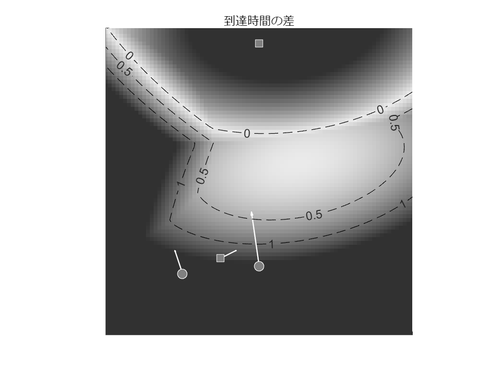

# <span style="color:rgb(213,80,0)">支配領域(速度と加速度を考慮)</span>

小中英嗣「科学で迫る勝敗の法則」


https://gihyo.jp/book/2024/978-4-297-13927-8


p.064

```matlab
clear
clc
close all
```

選手数と初期条件(位置，速度)の設定

```matlab
N.Teams=2;
N.Players=2;    %各チームの選手数
a=0.2;dt=0.025;
x0(:,:,1)=[[0;-1.1] [-1;-1.2]];
x0(:,:,2)=[[-0.5;-1.0] [0;1.8]];

v0(:,:,1)=[[-0.1;0.7] [-0.1;0.3]];
v0(:,:,2)=[[0.2;0.1] [0.0;0.0]];

vMax=1; %最高速度

figure;hold on;set(gca,'fontname','メイリオ')
axis equal

T=0:dt:5;
th=linspace(0,2*pi,17);
```

各選手最大加速度で移動したときの到達時間を計算

```matlab
%Team 1
mdl=[];
for k=1:N.Players
    outData=[];
    for n1=1:size(th,2)-1
        thVal=th(n1);
        tmpX=x0(:,k,1);
        tmpV=v0(:,k,1);
        for n2=1:size(T,2)
            tmpX=tmpX+tmpV*dt;
            tmpV=tmpV+a*[cos(thVal);sin(thVal)]*dt;
            if norm(tmpV)>vMax(1)
                tmpV=tmpV/norm(tmpV)*vMax(1);
            end
            outData=[outData; ...
                T(n2) tmpX'];
        end
    end

        flag=[];
        for n1=1:size(outData,1)
            for n2=n1+1:size(outData,1)
                if norm(outData(n1,2:3)-outData(n2,2:3))<0.01 ...
                        & outData(n1,1)+10*dt<outData(n2,1)
                    flag=[flag;n2];
                end
            end
        end

        outData(flag,:)=[];

    tmpMdl=stepwiselm(outData(:,2:3),outData(:,1),...
        "poly22");
    mdl=[mdl;{tmpMdl}];
end
```

```TextOutput
初期モデルに追加する、または初期モデルから削除する項はありません。
初期モデルに追加する、または初期モデルから削除する項はありません。
```

```matlab

%Team 2
mdl2=[];
for k=1:N.Players
    outData=[];
    for n1=1:size(th,2)-1
        tmpX=x0(:,k,2);
        tmpV=v0(:,k,2);
        thVal=th(n1);
        for n2=1:size(T,2)
            tmpX=tmpX+tmpV*dt;
            tmpV=tmpV+a*[cos(thVal);sin(thVal)]*dt;
            if norm(tmpV)>vMax(1)
                tmpV=tmpV/norm(tmpV)*vMax(1);
            end
            outData=[outData; ...
                T(n2) tmpX'];
        end
    end

        flag=[];
        for n1=1:size(outData,1)
            for n2=n1+1:size(outData,1)
                if norm(outData(n1,2:3)-outData(n2,2:3))<0.005 ...
                        & outData(n1,1)+10*dt<outData(n2,1)
                    flag=[flag;n2];
                end
            end
        end
    
        outData(flag,:)=[];

    tmpMdl=stepwiselm(outData(:,2:3),outData(:,1),...
        "poly22");
    mdl2=[mdl2;{tmpMdl}];
end
```

```TextOutput
初期モデルに追加する、または初期モデルから削除する項はありません。
初期モデルに追加する、または初期モデルから削除する項はありません。
```

```matlab

plotX=-2:0.05:2;
plotY=-2:0.05:2;

C=zeros(size(plotX,2),size(plotY,2));
for tmpX=plotX
    for tmpY=plotY
        ind1=find(plotX==tmpX);
        ind2=find(plotY==tmpY);
        tmpT1=min(predict(mdl{1},[tmpX tmpY]), ...
            predict(mdl{2},[tmpX tmpY]));
        tmpT2=min(predict(mdl2{1},[tmpX tmpY]), ...
            predict(mdl2{2},[tmpX tmpY]));
        C(ind1,ind2)=-tmpT1+tmpT2;
    end
end

hold on;
cmap=colormap("gray");
cmap=[(cmap(50:end-20,:));flipud(cmap(50:end-20,:))];
colormap(cmap);
caxis(1.5*[-1 1]);

imagesc(plotX, plotY,C');
% colorbar;
axis equal;
% for tVal=1:6
%     ind=outData(:,1)==tVal;
%     plot(outData(ind,2),outData(ind,3),'w--');
%
%     ind=outData2(:,1)==tVal;
%     plot(outData2(ind,2),outData2(ind,3),'w-');
% end
for n2=1:N.Teams
    for n1=1:N.Players
        quiver(x0(1,n1,n2), x0(2,n1,n2),...
            v0(1,n1,n2),v0(2,n1,n2),'w-','LineWidth',1, ...
            "ShowArrowHead","on", ...
            "AutoScaleFactor",1);
        switch n2
            case 1
                plot(x0(1,n1,n2), x0(2,n1,n2),...
                    'wo','MarkerFaceColor',0.5*[1 1 1],...
                    'MarkerSize',8);

            case 2
                plot(x0(1,n1,n2), x0(2,n1,n2),...
                    'ws','MarkerFaceColor',0.5*[1 1 1],...
                    "MarkerSize",8);
        end
    end
end
axis([-2 2 -2 2]);
xticklabels([]);yticklabels([]);
title('到達時間の差');
[XMesh, YMesh]=meshgrid(plotX,plotY);
hold on;
contour(XMesh   ,YMesh,C',[0 0.5 1],...
    'LineColor','k','LineStyle',"--", ...
    "ShowText","on")

exportgraphics(gcf,'pitchControlExample.pdf')
```

<center></center>

