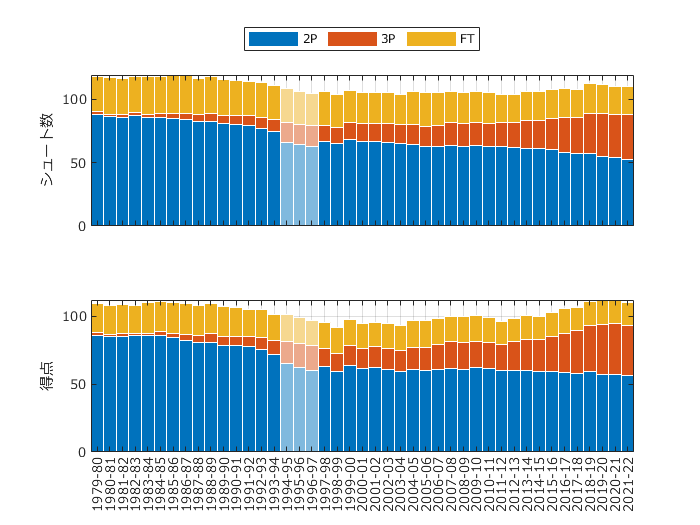

# <span style="color:rgb(213,80,0)">NBAでのシュート本数と得点数(1試合当たり)</span>

小中英嗣「科学で迫る勝敗の法則」


https://gihyo.jp/book/2024/978-4-297-13927-8


p.081

```matlab
clear
clc
close all
```

データ読み込み


(tableの変数名に関する警告が表示されますが，動作に問題はありません)

```matlab
tbl=readtable('NBAShotDataBySeason.xlsx');
```

```TextOutput
警告: ファイルからの列ヘッダーは、table の変数名の作成前に、有効な MATLAB 識別子になるように変更されました。元の列ヘッダーは、VariableDescriptions プロパティに保存されています。
元の列ヘッダーを table 変数名として使用するには、'VariableNamingRule' を 'preserve' に設定します。
```

```matlab
tbl.Season=categorical(tbl.Season);
figure
tiledlayout(2,1);nexttile;
bar(tbl.Season,[tbl.FGA-tbl.x3PA tbl.x3PA tbl.FTA],'stacked','BarWidth',1,'EdgeColor','W');
grid on;hold on;
ind=(tbl.Season=='1996-97') ...
    | (tbl.Season=='1995-96') ...
    | (tbl.Season=='1994-95');
bar(tbl.Season(ind),...
    [tbl.FGA(ind)-tbl.x3PA(ind) tbl.x3PA(ind) tbl.FTA(ind)],'stacked','BarWidth',1,'EdgeColor','W', ...
    'FaceColor','w','FaceAlpha',0.5);

set(gca,'fontname','メイリオ');
ylabel('シュート数');
xticklabels([]);

legend({'2P','3P','FT'},'Location','northoutside','Orientation','horizontal');

nexttile
bar(tbl.Season, [2*(tbl.FG-tbl.x3P) 3*tbl.x3P tbl.FT],'stacked','BarWidth',1,'EdgeColor','W');
grid on;hold on;
bar(tbl.Season(ind),...
    [2*(tbl.FG(ind)-tbl.x3P(ind)) 3*tbl.x3P(ind) tbl.FT(ind)],...
    'stacked','BarWidth',1,'EdgeColor','W',...
    'FaceColor','w','FaceAlpha',0.5);
ylabel('得点')
set(gca,'fontname','メイリオ');
exportgraphics(gcf,'NBAShotBySeason.pdf')
```

<center></center>


