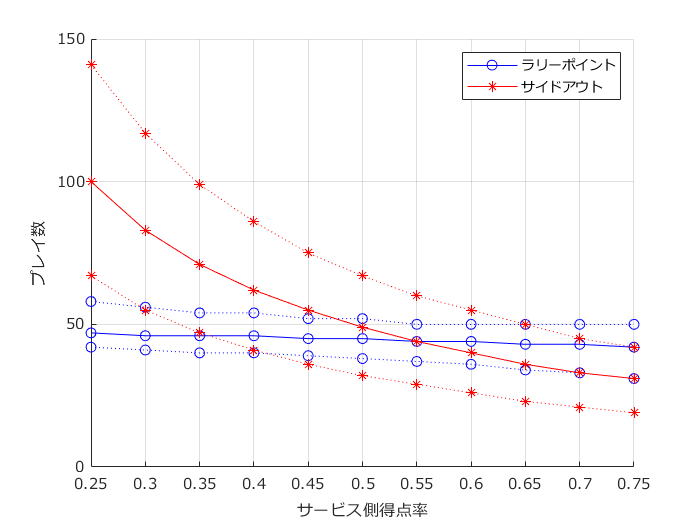

# <span style="color:rgb(213,80,0)">バレーボール：得点ルールと必要プレイ数の分布</span>

小中英嗣「科学で迫る勝敗の法則」


https://gihyo.jp/book/2024/978-4-297-13927-8


p.094

```matlab
clear
clc
close all

outData=[];
for pService=0.25:0.05:0.75   %サービス側が得点する確率
    pService
    nMatches=20000;

    numPlays=zeros(nMatches,1);
    numSets=zeros(nMatches,2);
    numPoints=zeros(nMatches,2);
```

ラリーポイント

```matlab
    for k=1:nMatches

        tmpPlays=0;
        tmpSets=[0 0];
        tmpPoints=[0 0];
        tmpService=1;

        while 1
            switch tmpService
                case 1
                    if rand(1,1) < pService
                        tmpPoints(1)=tmpPoints(1)+1;
                    else
                        tmpPoints(2)=tmpPoints(2)+1;
                        tmpService=2;
                    end
                case 2
                    if rand(1,1) < pService
                        tmpPoints(2)=tmpPoints(2)+1;
                    else
                        tmpPoints(1)=tmpPoints(1)+1;
                        tmpService=1;
                    end
            end
            tmpPlays=tmpPlays+1;
            if (tmpPoints(1)>=25 & abs(tmpPoints(1)-tmpPoints(2))>=2) ...
                    | (tmpPoints(2)>=25 & abs(tmpPoints(1)-tmpPoints(2))>=2)
                break
            end
        end

        numPlays(k)=tmpPlays;
        numPoints(k,:)=tmpPoints;
    end

```

```TextOutput
pService = 0.2500
pService = 0.3000
pService = 0.3500
pService = 0.4000
pService = 0.4500
pService = 0.5000
pService = 0.5500
pService = 0.6000
pService = 0.6500
pService = 0.7000
pService = 0.7500
```

サイドアウト

```matlab
    numPlays_s=zeros(nMatches,1);
    numSets_s=zeros(nMatches,2);
    numPoints_s=zeros(nMatches,2);

    for k=1:nMatches

        tmpPlays=0;
        tmpSets=[0 0];
        tmpPoints=[0 0];
        tmpService=1;

        while 1
            switch tmpService
                case 1
                    if rand(1,1) < pService
                        tmpPoints(1)=tmpPoints(1)+1;
                    else
                        tmpService=2;
                    end
                case 2
                    if rand(1,1) < pService
                        tmpPoints(2)=tmpPoints(2)+1;
                    else
                        tmpService=1;
                    end
            end
            tmpPlays=tmpPlays+1;
            if (tmpPoints(1)>=15 & abs(tmpPoints(1)-tmpPoints(2))>=2) ...
                    | (tmpPoints(2)>=15 & abs(tmpPoints(1)-tmpPoints(2))>=2)
                break
            end
        end

        numPlays_s(k)=tmpPlays;
        numPoints_s(k,:)=tmpPoints;
    end
    
```

それぞれのルールでの5%, 50%, 95%分位数を記録

```matlab
    outData=[outData;
        pService ...
        prctile(numPlays,5) prctile(numPlays,50) prctile(numPlays,95),...
        prctile(numPlays_s,5) prctile(numPlays_s,50) prctile(numPlays_s,95),...
        ];
end
```

```matlab

figure;hold on;
h1=plot(outData(:,1), ...
    outData(:,3),'bo-');
plot(outData(:,1), ...
    outData(:,2),'bo:');
plot(outData(:,1), ...
    outData(:,4),'bo:');

hold on;grid on;
set(gca,'fontname','メイリオ')
h2=plot(outData(:,1), ...
    outData(:,6),'r*-');
plot(outData(:,1), ...
    outData(:,5),'r*:');
plot(outData(:,1), ...
    outData(:,7),'r*:');
xlabel('サービス側得点率')
ylabel('プレイ数')
legend([h1,h2],{'ラリーポイント','サイドアウト'})
exportgraphics(gcf,'volleyball_rally_sideout_sim.pdf')
```

<center></center>

