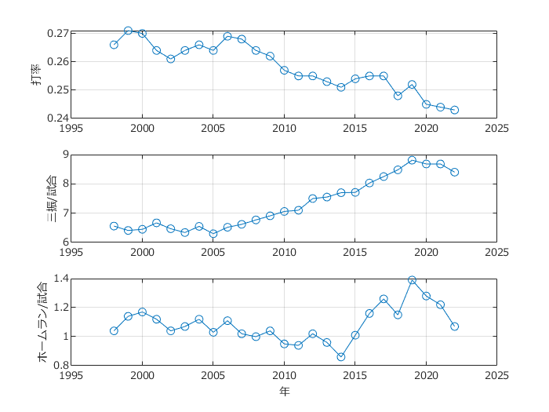

# <span style="color:rgb(213,80,0)">MLBの打撃成績</span>

小中英嗣「科学で迫る勝敗の法則」


https://gihyo.jp/book/2024/978-4-297-13927-8


p.099

```matlab
clear
clc
close all
```

データ読み込み


(tableの変数名に関する警告が表示されますが，動作に問題はありません)

```matlab
tbl=readtable('MLB_BattingStats.xlsx');
```

```TextOutput
警告: ファイルからの列ヘッダーは、table の変数名の作成前に、有効な MATLAB 識別子になるように変更されました。元の列ヘッダーは、VariableDescriptions プロパティに保存されています。
元の列ヘッダーを table 変数名として使用するには、'VariableNamingRule' を 'preserve' に設定します。
```

```matlab
tbl=tbl(tbl.Year>=1998,:);
tlo=tiledlayout(3,1);nexttile

plot(tbl.Year, tbl.BA,'o-');grid on;hold on;
set(gca,'fontname','メイリオ');
xlabel('');ylabel('打率')
hold off

nexttile(tlo)
plot(tbl.Year, tbl.SO,'o-');grid on;hold on;
set(gca,'fontname','メイリオ');
xlabel('');ylabel('三振/試合')

nexttile(tlo)
plot(tbl.Year, tbl.HR,'o-');grid on;hold on;
set(gca,'fontname','メイリオ');
xlabel('');ylabel('ホームラン/試合')

xlabel('年')

exportgraphics(gcf,'MLB_BattingStats.pdf')
```

<center></center>

