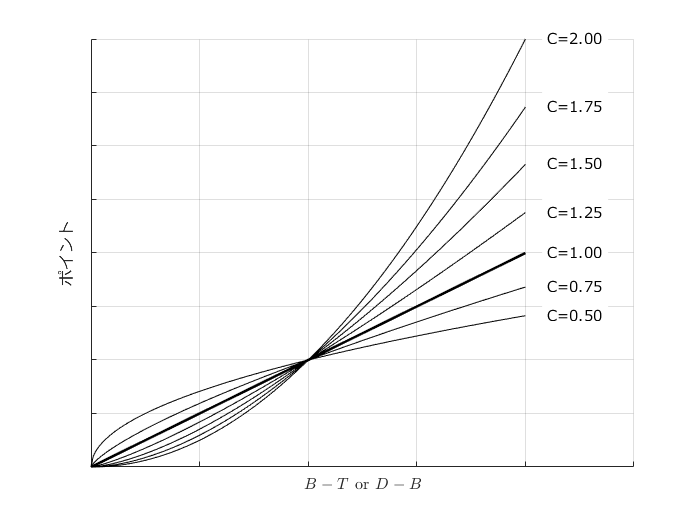

# <span style="color:rgb(213,80,0)">十種競技の記録と得点</span>

小中英嗣「科学で迫る勝敗の法則」


https://gihyo.jp/book/2024/978-4-297-13927-8


p.120

```matlab
clear
clc
close all

x=0:0.01:2;
C=0.5:0.25:2.0;

figure
hold on;grid on;set(gca,'fontname','メイリオ')
for n1=1:size(C,2)
    plot(x,x.^C(n1),'k-')
    if C(n1)==1
    plot(x,x.^C(n1),'k-','LineWidth',1.5)
    end
    text(2.1, x(end)^C(n1),['C=' num2str(C(n1),'%1.2f')], ...
        'fontname','メイリオ','BackgroundColor','w');
end
xlim([0 2.5]);xticklabels([]);xlabel(' $B-T$ or $D-B$ ','Interpreter','latex')
yticklabels([]);ylabel('ポイント')
exportgraphics(gca,'decathlonPointTable.pdf')
```

<center></center>

