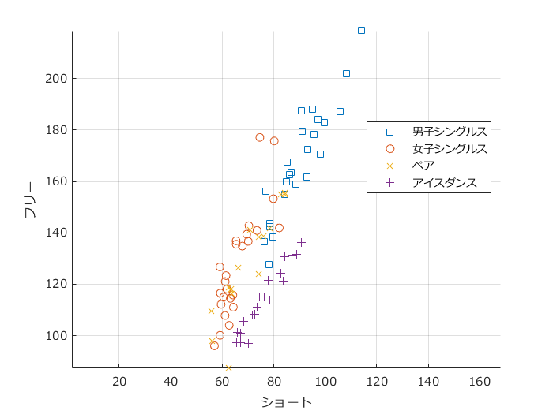
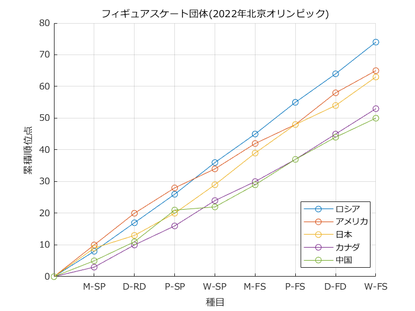
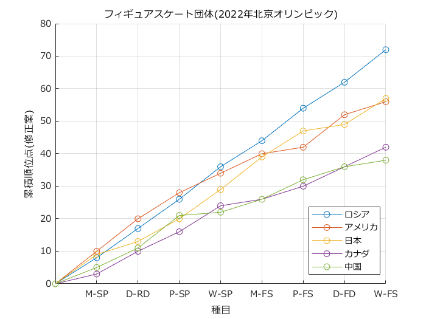

# <span style="color:rgb(213,80,0)">フィギュアスケートの得点</span>

小中英嗣「科学で迫る勝敗の法則」


https://gihyo.jp/book/2024/978-4-297-13927-8


p.124

```matlab
clear
clc
close all
```

データ読み込み

```matlab
tbl_M=readtable('figureSkatingBeijing2022.xlsx','Sheet','M');
tbl_W=readtable('figureSkatingBeijing2022.xlsx','Sheet','W');
tbl_P=readtable('figureSkatingBeijing2022.xlsx','Sheet','P');
tbl_D=readtable('figureSkatingBeijing2022.xlsx','Sheet','D');

figure
hold on;axis equal;grid on;
set(gca,'fontname','メイリオ')
scatter(tbl_M.SPPoints,tbl_M.FSPoints,'s')
scatter(tbl_W.SPPoints,tbl_W.FSPoints,'o')
scatter(tbl_P.SPPoints,tbl_P.FSPoints,'x')
scatter(tbl_D.RDPoints,tbl_D.FDPoints,'+')
legend({'男子シングルス','女子シングルス','ペア','アイスダンス'},...
    'Location','best');
xlabel('ショート')
ylabel('フリー')

exportgraphics(gcf,'figureSkatingBeijing2022.pdf');
```

<center></center>


データ読み込み


(tableの変数名に関する警告が表示されますが，動作に問題はありません)

```matlab
tbl_2022=readtable('figureSkatingBeijing2022.xlsx','Sheet','2022');
```

```TextOutput
警告: ファイルからの列ヘッダーは、table の変数名の作成前に、有効な MATLAB 識別子になるように変更されました。元の列ヘッダーは、VariableDescriptions プロパティに保存されています。
元の列ヘッダーを table 変数名として使用するには、'VariableNamingRule' を 'preserve' に設定します。
```

```matlab
plotData=table2array(tbl_2022(:,3:end-1));
plotData2=plotData;
plotData=[zeros(5,1) cumsum(plotData,2)];

```

順位点の変更

```matlab
ind = plotData2==6; ind(:,1:4)=false;
plotData2(ind)=2;
ind = plotData2==7; ind(:,1:4)=false;
plotData2(ind)=4;
ind = plotData2==8; ind(:,1:4)=false;
plotData2(ind)=6;
ind = plotData2==9; ind(:,1:4)=false;
plotData2(ind)=8;
plotData2=[zeros(5,1) cumsum(plotData2,2)];

```

順位点の推移(書籍未収録)

```matlab
figure
hold on;grid on;
set(gca,'fontname','メイリオ')
plot(plotData','o-')
legend(tbl_2022.Nation,'Location',"best")
xticks(2:9)
xticklabels(strrep(tbl_2022.Properties.VariableNames(3:10),'_','-'));
xlabel('種目')
ylabel('累積順位点')
title('フィギュアスケート団体(2022年北京オリンピック)')
```

<center></center>


```matlab
figure
hold on;grid on;
set(gca,'fontname','メイリオ')
plot(plotData2','o-')
legend(tbl_2022.Nation,'Location',"best")
xticks(2:9)
xticklabels(strrep(tbl_2022.Properties.VariableNames(3:10),'_','-'));
xlabel('種目')
ylabel('累積順位点(修正案)')
title('フィギュアスケート団体(2022年北京オリンピック)')
```

<center></center>

