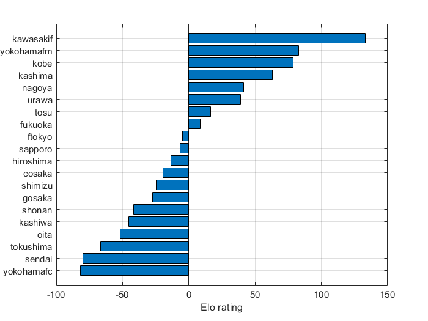

# <span style="color:rgb(213,80,0)">Eloレーティングの計算サンプル</span>

小中英嗣「科学で迫る勝敗の法則」


https://gihyo.jp/book/2024/978-4-297-13927-8


p.151-

```matlab
clear;
clc;
close all;

```

csvファイルを読み込む

```matlab
tbl=readtable('JResult2021.csv');
tbl.Category=categorical(tbl.Category);

```

J1の試合のみ抽出

```matlab
tbl_J1=tbl(tbl.Category=='Ｊ１',:)
```
| |Year|Category|MatchSec|Date|DayOfWeek|HomeE|HomeJ|AwayE|AwayJ|HomeGoals|AwayGoals|MatchID|Venue|Attendance|
|:--:|:--:|:--:|:--:|:--:|:--:|:--:|:--:|:--:|:--:|:--:|:--:|:--:|:--:|:--:|
|1|2021|Ｊ１|'第１節第１日'|2021/02/26|'金'|'kawasakif'|'川崎Ｆ'|'yokohamafm'|'横浜FM'|2|0|24974|'等々力'|4868|
|2|2021|Ｊ１|'第１節第２日'|2021/02/27|'土'|'urawa'|'浦和'|'ftokyo'|'FC東京'|1|1|24976|'埼玉'|4943|
|3|2021|Ｊ１|'第１節第２日'|2021/02/27|'土'|'sapporo'|'札幌'|'yokohamafc'|'横浜FC'|5|1|24975|'札幌ド'|11897|
|4|2021|Ｊ１|'第１節第２日'|2021/02/27|'土'|'oita'|'大分'|'tokushima'|'徳島'|1|1|24978|'昭和電ド'|7012|
|5|2021|Ｊ１|'第１節第２日'|2021/02/27|'土'|'hiroshima'|'広島'|'sendai'|'仙台'|1|1|24977|'Ｅスタ'|8820|
|6|2021|Ｊ１|'第１節第２日'|2021/02/27|'土'|'kashima'|'鹿島'|'shimizu'|'清水'|1|3|24979|'カシマ'|9312|
|7|2021|Ｊ１|'第１節第２日'|2021/02/27|'土'|'shonan'|'湘南'|'tosu'|'鳥栖'|0|1|24980|'レモンＳ'|4721|
|8|2021|Ｊ１|'第１節第２日'|2021/02/27|'土'|'cosaka'|'Ｃ大阪'|'kashiwa'|'柏'|2|0|24981|'ヤンマー'|4481|
|9|2021|Ｊ１|'第１節第２日'|2021/02/27|'土'|'kobe'|'神戸'|'gosaka'|'Ｇ大阪'|1|0|24982|'ノエスタ'|4636|
|10|2021|Ｊ１|'第１節第３日'|2021/02/28|'日'|'fukuoka'|'福岡'|'nagoya'|'名古屋'|1|2|24983|'ベススタ'|4991|
|11|2021|Ｊ１|'第１１節第１日'|2021/03/03|'水'|'kawasakif'|'川崎Ｆ'|'cosaka'|'Ｃ大阪'|3|2|25074|'等々力'|4756|
|12|2021|Ｊ１|'第２節第１日'|2021/03/06|'土'|'shimizu'|'清水'|'fukuoka'|'福岡'|2|2|24986|'アイスタ'|9063|
|13|2021|Ｊ１|'第２節第１日'|2021/03/06|'土'|'ftokyo'|'FC東京'|'cosaka'|'Ｃ大阪'|3|2|24985|'味スタ'|4768|
|14|2021|Ｊ１|'第２節第１日'|2021/03/06|'土'|'tokushima'|'徳島'|'kobe'|'神戸'|1|1|24987|'鳴門大塚'|7454|


チーム名を抽出する

```matlab
teamNames=unique([tbl_J1.HomeE;tbl_J1.AwayE]);
tbl_J1.HomeE=categorical(tbl_J1.HomeE, teamNames);
tbl_J1.AwayE=categorical(tbl_J1.AwayE, teamNames);

```

Eloレーティングの計算

```matlab
r=zeros(size(teamNames));
K=16;
for n1=1:size(tbl_J1,1)
    tiNum=find(teamNames==tbl_J1.HomeE(n1));
    tjNum=find(teamNames==tbl_J1.AwayE(n1));
    ri=r(tiNum);
    rj=r(tjNum);
    rDiff=ri-rj;
    wHat_ij=1/(1+10^(-rDiff/400));
    w_ij=1*(tbl_J1.HomeGoals(n1)>tbl_J1.AwayGoals(n1)) ...
        +0.5*(tbl_J1.HomeGoals(n1)==tbl_J1.AwayGoals(n1));
    r(tiNum)=ri+K*(w_ij-wHat_ij);
    r(tjNum)=rj-K*(w_ij-wHat_ij);
end

```

レーティング順に表示

```matlab
tbl_teams=table();
tbl_teams=addvars(tbl_teams, teamNames, 'NewVariableNames','TeamE');
tbl_teams.TeamE=categorical(tbl_teams.TeamE);
tbl_teams=addvars(tbl_teams, r, 'NewVariableNames','Rating');
tbl_teams=sortrows(tbl_teams,"Rating",'descend');
tbl_teams=addvars(tbl_teams, (1:size(teamNames,1))', 'NewVariableNames','RankByRating');
tbl_teams
```
| |TeamE|Rating|RankByRating|
|:--:|:--:|:--:|:--:|
|1|kawasakif|132.9881|1|
|2|yokohamafm|82.9966|2|
|3|kobe|78.6122|3|
|4|kashima|63.2783|4|
|5|nagoya|41.2260|5|
|6|urawa|38.9892|6|
|7|tosu|16.6859|7|
|8|fukuoka|8.7633|8|
|9|ftokyo|-4.7780|9|
|10|sapporo|-6.7662|10|
|11|hiroshima|-13.5497|11|
|12|cosaka|-19.5657|12|
|13|shimizu|-24.3822|13|
|14|gosaka|-27.2959|14|


横棒グラフで図示

```matlab
figure;
barh(tbl_teams.Rating);
grid on;
set(gca,'ydir','reverse','fontname','Arial');
yticks(1:size(teamNames,1));
yticklabels(tbl_teams.TeamE);
xlabel('Elo rating');
exportgraphics(gcf,'EloRatingSample.pdf');
```

<center></center>

