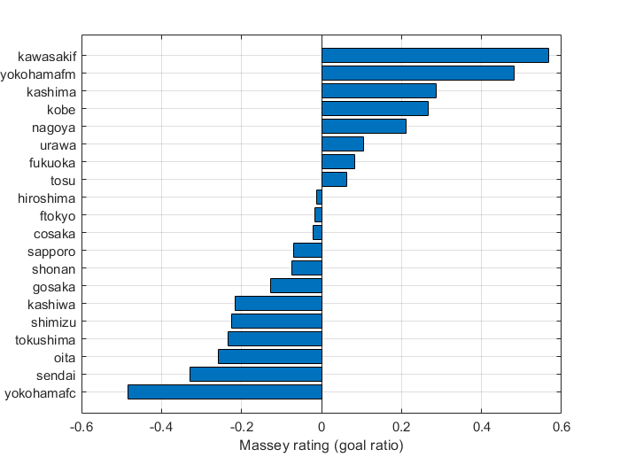

# <span style="color:rgb(213,80,0)">得失点割合からレーティングを計算するサンプル</span>

小中英嗣「科学で迫る勝敗の法則」


[https://gihyo.jp/book/2024/978-4-297-13927-8](https://gihyo.jp/book/2024/978-4-297-13927-8)


p.153-

```matlab
clear;
clc;
close all;

```

csvファイルを読み込む

```matlab
tbl=readtable('JResult2021.csv');
tbl.Category=categorical(tbl.Category);
```

J1の試合のみ抽出

```matlab
tbl_J1=tbl(tbl.Category=='Ｊ１',:)
```
| |Year|Category|MatchSec|Date|DayOfWeek|HomeE|HomeJ|AwayE|AwayJ|HomeGoals|AwayGoals|MatchID|Venue|Attendance|
|:--:|:--:|:--:|:--:|:--:|:--:|:--:|:--:|:--:|:--:|:--:|:--:|:--:|:--:|:--:|
|1|2021|Ｊ１|'第１節第１日'|2021/02/26|'金'|'kawasakif'|'川崎Ｆ'|'yokohamafm'|'横浜FM'|2|0|24974|'等々力'|4868|
|2|2021|Ｊ１|'第１節第２日'|2021/02/27|'土'|'urawa'|'浦和'|'ftokyo'|'FC東京'|1|1|24976|'埼玉'|4943|
|3|2021|Ｊ１|'第１節第２日'|2021/02/27|'土'|'sapporo'|'札幌'|'yokohamafc'|'横浜FC'|5|1|24975|'札幌ド'|11897|
|4|2021|Ｊ１|'第１節第２日'|2021/02/27|'土'|'oita'|'大分'|'tokushima'|'徳島'|1|1|24978|'昭和電ド'|7012|
|5|2021|Ｊ１|'第１節第２日'|2021/02/27|'土'|'hiroshima'|'広島'|'sendai'|'仙台'|1|1|24977|'Ｅスタ'|8820|
|6|2021|Ｊ１|'第１節第２日'|2021/02/27|'土'|'kashima'|'鹿島'|'shimizu'|'清水'|1|3|24979|'カシマ'|9312|
|7|2021|Ｊ１|'第１節第２日'|2021/02/27|'土'|'shonan'|'湘南'|'tosu'|'鳥栖'|0|1|24980|'レモンＳ'|4721|
|8|2021|Ｊ１|'第１節第２日'|2021/02/27|'土'|'cosaka'|'Ｃ大阪'|'kashiwa'|'柏'|2|0|24981|'ヤンマー'|4481|
|9|2021|Ｊ１|'第１節第２日'|2021/02/27|'土'|'kobe'|'神戸'|'gosaka'|'Ｇ大阪'|1|0|24982|'ノエスタ'|4636|
|10|2021|Ｊ１|'第１節第３日'|2021/02/28|'日'|'fukuoka'|'福岡'|'nagoya'|'名古屋'|1|2|24983|'ベススタ'|4991|
|11|2021|Ｊ１|'第１１節第１日'|2021/03/03|'水'|'kawasakif'|'川崎Ｆ'|'cosaka'|'Ｃ大阪'|3|2|25074|'等々力'|4756|
|12|2021|Ｊ１|'第２節第１日'|2021/03/06|'土'|'shimizu'|'清水'|'fukuoka'|'福岡'|2|2|24986|'アイスタ'|9063|
|13|2021|Ｊ１|'第２節第１日'|2021/03/06|'土'|'ftokyo'|'FC東京'|'cosaka'|'Ｃ大阪'|3|2|24985|'味スタ'|4768|
|14|2021|Ｊ１|'第２節第１日'|2021/03/06|'土'|'tokushima'|'徳島'|'kobe'|'神戸'|1|1|24987|'鳴門大塚'|7454|


チーム名を抽出する

```matlab
teamNames=unique([tbl_J1.HomeE;tbl_J1.AwayE]);
tbl_J1.HomeE=categorical(tbl_J1.HomeE, teamNames);
tbl_J1.AwayE=categorical(tbl_J1.AwayE, teamNames);
```

レーティングの計算

```matlab
r=zeros(size(teamNames));
M=zeros(size(tbl_J1,1)+1, size(teamNames,1));
b=zeros(size(tbl_J1,1)+1, 1);

for n1=1:size(tbl_J1,1)
    tiNum=find(teamNames==tbl_J1.HomeE(n1));
    tjNum=find(teamNames==tbl_J1.AwayE(n1));
    M(n1,tiNum)=1;
    M(n1,tjNum)=-1;
    b(n1)=log( (tbl_J1.HomeGoals(n1)+1)/(tbl_J1.AwayGoals(n1)+1) );
end
M(end,:)=1;
r=pinv(M)*b;
```

レーティング順に表示

```matlab
tbl_teams=table();
tbl_teams=addvars(tbl_teams, teamNames, 'NewVariableNames','TeamE');
tbl_teams.TeamE=categorical(tbl_teams.TeamE);
tbl_teams=addvars(tbl_teams, r, 'NewVariableNames','Rating');
tbl_teams=sortrows(tbl_teams,"Rating",'descend');
tbl_teams=addvars(tbl_teams, (1:size(teamNames,1))', 'NewVariableNames','RankByRating');
tbl_teams
```
| |TeamE|Rating|RankByRating|
|:--:|:--:|:--:|:--:|
|1|kawasakif|0.5670|1|
|2|yokohamafm|0.4823|2|
|3|kashima|0.2868|3|
|4|kobe|0.2668|4|
|5|nagoya|0.2125|5|
|6|urawa|0.1056|6|
|7|fukuoka|0.0837|7|
|8|tosu|0.0624|8|
|9|hiroshima|-0.0118|9|
|10|ftokyo|-0.0163|10|
|11|cosaka|-0.0203|11|
|12|sapporo|-0.0703|12|
|13|shonan|-0.0749|13|
|14|gosaka|-0.1269|14|


横棒グラフで図示

```matlab
figure;
barh(tbl_teams.Rating);
grid on;
set(gca,'ydir','reverse','fontname','Arial');
yticks(1:size(teamNames,1));
yticklabels(tbl_teams.TeamE);
xlabel('Massey rating (goal ratio)');
exportgraphics(gcf,'GoalRatioRatingSample.pdf');
```

<center></center>

