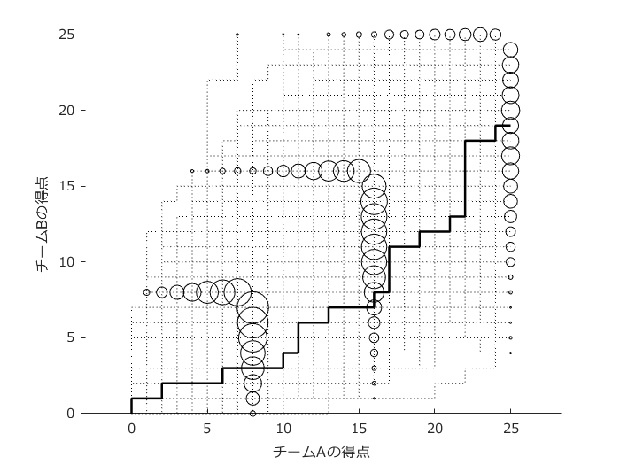

# <span style="color:rgb(213,80,0)">バレーボールのランダムウォークモデル</span>

小中英嗣「科学で迫る勝敗の法則」


https://gihyo.jp/book/2024/978-4-297-13927-8


p.171

```matlab
clear
clc
close all
```

得点確率を設定

```matlab
p=0.55;
```

シミュレーション試合数

```matlab
Opt.nMatches=1000;

rng(1);%括弧の中の数値を変えると乱数が変わります．
figure;axis equal;hold on;
set(gca,'fontname','メイリオ')
outData=[];
outData2=[];
outData3=[];

for k=1:Opt.nMatches
    tmp=[0 0];
    while max(tmp(end,:))<25
        if rand()<p
            tmp=[tmp;tmp(end,:)+[1,0]];
        else
            tmp=[tmp;tmp(end,:)+[0,1]];
        end
    end
    ind= (max(tmp,[],2)==25) ...
        | (max(tmp,[],2)==16 & sum(tmp,2)~=32) ...
        | (max(tmp,[],2)==8 & sum(tmp,2)~=16);

    outData=[outData;tmp(ind,:)];

    ind= (max(tmp,[],2)==25);
    outData2=[outData2;tmp(ind,:)];

    plot(tmp(:,1),tmp(:,2),'k:');
    if k==2
        plot(tmp(:,1),tmp(:,2),'k-','LineWidth',1.5);
    end
end

for k=1:Opt.nMatches
    tmp=[0 0];
    while max(tmp(end,:))<15
        if rand()<p
            tmp=[tmp;tmp(end,:)+[1,0]];
        else
            tmp=[tmp;tmp(end,:)+[0,1]];
        end
    end
    ind= (max(tmp,[],2)==15 & sum(tmp,2)~=30);
    outData3=[outData3;tmp(ind,:)];

end

```

セット勝率

```matlab
pSetWin=[sum(outData2(:,1)==25) sum(outData2(:,2)==25)]/Opt.nMatches
```

```TextOutput
pSetWin = 1x2    
    0.7680    0.2320
```

セット勝率(第5セット)

```matlab
pSetWin_set5=[sum(outData3(:,1)==15) sum(outData3(:,2)==15)]/Opt.nMatches
```

```TextOutput
pSetWin_set5 = 1x2    
    0.6980    0.3020
```

```matlab
[C,ia,ic] = unique(outData,"rows");
a_counts = accumarray(ic,1);
scatter(C(:,1),C(:,2),a_counts(:)*2,'k')
xlabel('チームAの得点');
ylabel('チームBの得点');
exportgraphics(gcf,'volleyballRandomWalkSample.pdf')
```

<center></center>


セット取得数ごとの確率(順に，3-0, 3-1, 3-2, 2-3, 1-3, 0-3)

```matlab
[pSetWin(1)^3;
    3*pSetWin(1)^2*pSetWin(2)*pSetWin(1)
    6*pSetWin(1)^2*pSetWin(2)^2*pSetWin_set5(1)
    6*pSetWin(1)^2*pSetWin(2)^2*pSetWin_set5(2)
    3*pSetWin(1)*pSetWin(2)^2*pSetWin(2)
    pSetWin(2)^3
    ]
```

```TextOutput
ans = 6x1    
    0.4530
    0.3153
    0.1330
    0.0575
    0.0288
    0.0125
```

試合勝率

```matlab
sum(ans(1:3))
```

```TextOutput
ans = 0.9012
```
