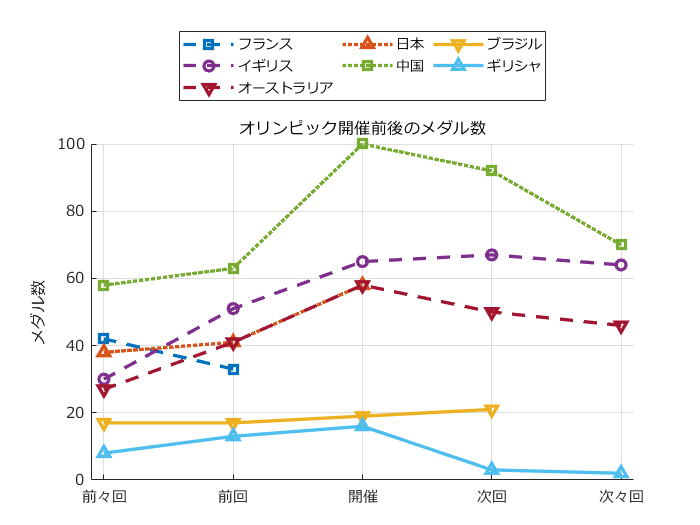

# <span style="color:rgb(213,80,0)">オリンピック開催国　前後のメダル数</span>

小中英嗣「科学で迫る勝敗の法則」


https://gihyo.jp/book/2024/978-4-297-13927-8


p.183

```matlab
clear
clc
close all

tbl=readtable('OlympicHosts.xlsx','VariableNamingRule','preserve')
```
| |年|大会|国|前々回|前回|開催|次回|次々回|
|:--:|:--:|:--:|:--:|:--:|:--:|:--:|:--:|:--:|
|1|2024|'パリ'|'フランス'|42|33|NaN|NaN|NaN|
|2|2020|'東京'|'日本'|38|41|58|NaN|NaN|
|3|2016|'リオ'|'ブラジル'|17|17|19|21|NaN|
|4|2012|'ロンドン'|'イギリス'|30|51|65|67|64|
|5|2008|'北京'|'中国'|58|63|100|92|70|
|6|2004|'アテネ'|'ギリシャ'|8|13|16|3|2|
|7|2000|'シドニー'|'オーストラリア'|27|41|58|50|46|

```matlab

lineStyleStrs={'-','--',':'};
markerStyleStrs={'o','s','^','v'};

figure
hold on;grid on;set(gca,'fontname','メイリオ')
for n1=1:size(tbl,1)
    ind1=mod(n1, size(lineStyleStrs,2))+1;
    ind2=mod(n1, size(markerStyleStrs,2))+1;
    styleStr=[lineStyleStrs{ind1} markerStyleStrs{ind2}];
    plot(table2array( tbl(n1,4:8)),styleStr,'linewidth',2);
end
xticks(1:5)
xticklabels(tbl.Properties.VariableNames(4:8))
ylabel('メダル数')
xlim([0.9 5.1])
legend(string(tbl.("国")),'Orientation','horizontal', ...
    'Location','northoutside','NumColumns',3)
title('オリンピック開催前後のメダル数')
exportgraphics(gcf,'OlympicHostsMedal.pdf')
```

<center></center>

